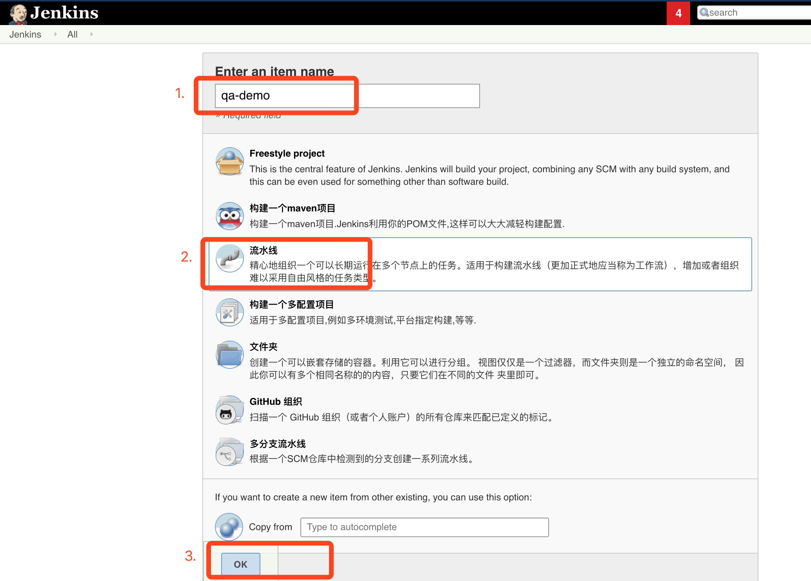

# QA-community-201909
For thoughtworks(wuhan) QA-community-201909

Stack: jenkins, docker, sonarqube

目的： 利用 docker 本地搭建CI/CD 环境，并执行 单元测试，集成测试，代码扫描等步骤，最后部署在本地

###  1.安装docker

- **Mac**
[install on mac](https://docs.docker.com/v17.12/docker-for-mac/install/#download-docker-for-mac)

- **Windows**
[install on windows](https://docs.docker.com/docker-for-windows/install/)


获取镜像到本地：
```bash
docker pull sonarqube:7.8-community
docker pull jenkins/jenkins:2.184
```

### 2.安装 jenkins
>ref: https://jenkins.io/doc/book/installing/

启动Jenkins
```bash
docker run -d  --name tw-jenkins \
-p 8080:8080 \
-v /var/run/docker.sock:/var/run/docker.sock \
-v $PWD/jenkins:/var/jenkins_home \
jenkins/jenkins:2.184
```
> **wait: 5s**


设置Jenkins，用root用户进入容器，以便后续安装
`docker exec -it -u root tw-jenkins bash` 

jenkins容器中安装docker环境，为后续构建镜像和做准备，将以下命令在jenkins 容器中运行

```bash
chmod 755 /var/run/docker.sock
apt-get update && \
apt-get -y install apt-transport-https \
     ca-certificates \
     curl \
     gnupg2 \
     software-properties-common && \
curl -fsSL https://download.docker.com/linux/$(. /etc/os-release; echo "$ID")/gpg > /tmp/dkey; apt-key add /tmp/dkey && \
add-apt-repository \
   "deb [arch=amd64] https://download.docker.com/linux/$(. /etc/os-release; echo "$ID") \
   $(lsb_release -cs) \
   stable" && \
apt-get update && \
apt-get -y install docker-ce
```
> **wait: 5min**

配置jenkins  安装插件
- pipeline
- gitlab
> **wait: 5min**

### 3.安装 sonarqube

>ref: https://docs.docker.com/samples/library/sonarqube/

启动sonarqube:

`docker run -d --name tw-sonarqube -p 9000:9000 sonarqube:7.8-community`

> **wait 5s**

In the window above, please click the Login button to login to the administrator account of SonarQube with “admin” username and password is also “admin”.

##### install sonar scanner
https://docs.sonarqube.org/latest/analysis/scan/sonarscanner/


sonar  页面安装插件

doc ref: https://github.com/ValaxyTech/DevOpsDemos/blob/master/SonarQube/Sonar_Integration_with_Jenkins.MD
https://www.youtube.com/watch?v=k-3krTRuAFA

### 新建jenkins job
"jenkins" --> "New Item"  



