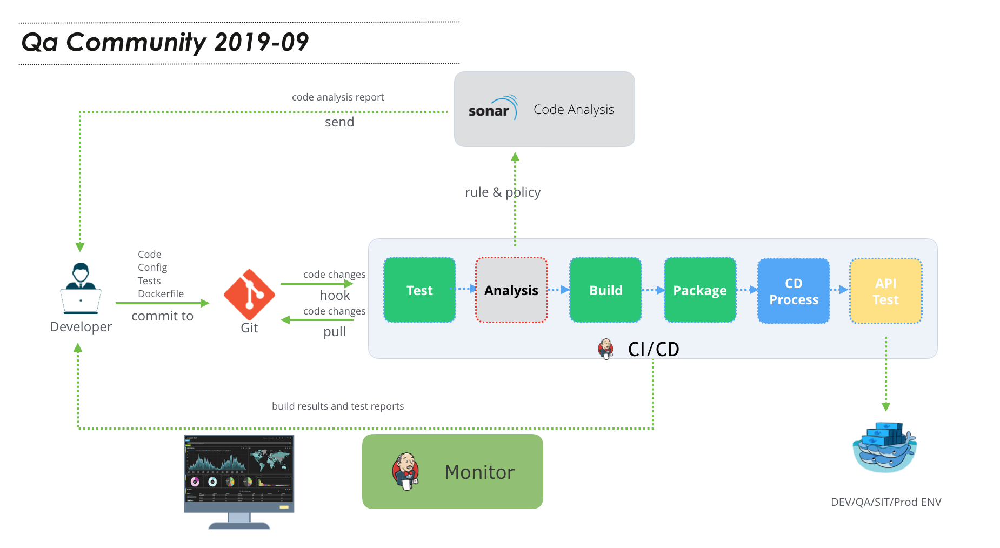
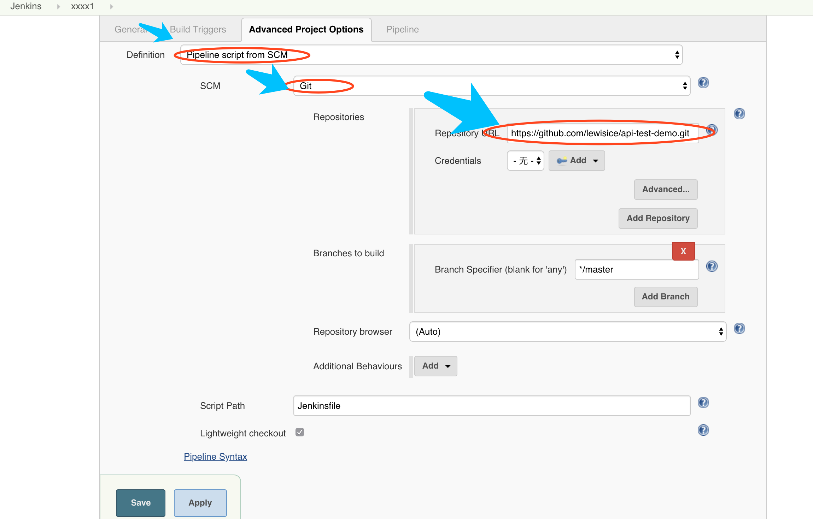
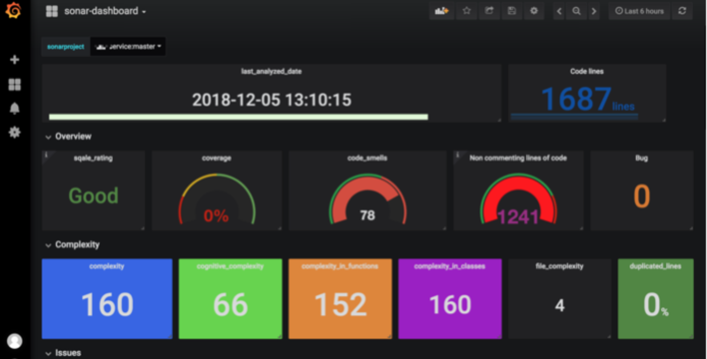

<h4 style="color: red;">Only for non-production environment</h4>

# QA-community-201909
For thoughtworks(wuhan) QA-community-201909

**Stack**: git, jenkins, docker, sonarqube




目的： 利用 docker 本地搭建CI/CD 环境，并执行 单元测试，集成测试，代码扫描等步骤，最后部署在本地

###  1.安装docker

- **Mac**
[install on mac](https://docs.docker.com/v17.12/docker-for-mac/install/#download-docker-for-mac)

- **Windows**
[install on windows](https://docs.docker.com/docker-for-windows/install/)

> **wait: 10m**

获取镜像到本地：
```bash
docker pull sonarqube:7.8-community
docker pull cicddraft/jenkins:v0.4
```

如有网络原因，可采取导入本地镜像包
```bash
docker load < my_image.tar
docker images 
```

### 2.安装 jenkins

启动Jenkins (Start the container with mounted docker daemon)

`docker run --name tw-jenkins -d  -p 8081:8080  -v /var/run/docker.sock:/var/run/docker.sock cicddraft/jenkins:v0.4`

>or 
```bash
docker run --name tw-jenkins -d    \
-p 8081:8080   \
-v /var/run/docker.sock:/var/run/docker.sock \
cicddraft/jenkins:v0.4
```

> **wait: 5s**

浏览器中访问：http://localhost:8081 进入jenkins页面


- 在jenkins容器中，安装jmeter 

```bash
###login jenkins container 
docker exec -it tw-jenkins bash

### install jmeter in container
wget -P /opt http://mirrors.tuna.tsinghua.edu.cn/apache//jmeter/binaries/apache-jmeter-5.1.1.tgz
cd /opt && tar -xf /opt/apache-jmeter-5.1.1.tgz
```

测试jmeter 是否安装成功

`/opt/apache-jmeter-5.1.1/bin/jmeter.sh  -h`

### 3.安装 sonarqube

>ref: https://docs.docker.com/samples/library/sonarqube/

启动sonarqube:

`docker run -d --name tw-sonarqube -p 9000:9000 sonarqube:7.8-community`

> **wait 5s**

浏览器中访问： http://localhost:9000  进入 sonarqube 页面

In the window above, please click the Login button to login to the administrator account of SonarQube with “admin” username and password is also “admin”.

### 4.新建jenkins pipeline job,并运行

springBoot 代码仓库:
- https://github.com/lewisice/api-test-demo 

1. 登陆 localhost:8081

2. 点击 **"jenkins"** --> **"New Item"** 

3. 输入名称： "pipeline-demo1   (可自定义想要的名称)

4. 选择 **"流水线(pipeline)"**

5. Source Code Management 选择 **"Git"**，并补充以下信息：

|    key | value   | 
|--------|-----------    | 
|Repository URL | `https://github.com/lewisice/api-test-demo` | 
|Branch Specifier | `*/cicd` | 

6. 点击 **"Save"** 保存




访问部署好的服务：
http://localhost:8888/api/increase?number=329


清理环境：
`docker stop  api-container  tw-jenkins tw-sonarqube && docker rm api-container tw-jenkins tw-sonarqube`

---
what's more:
- https://github.com/qinrui777/sonarqube-metric-to-grafana

      
